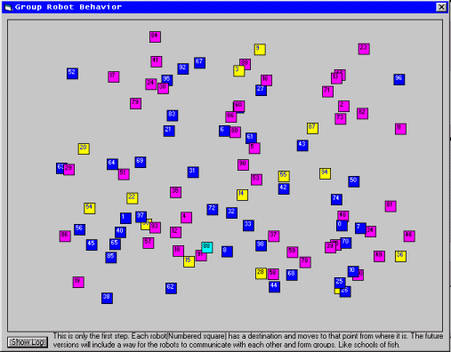



## Group Robot simulation

### Description

this code was designed to test out how small robots could work together and move in an environment together. This is just the start I will add the completed version soon.
 
### More Info
 

             |
---                |---
**Submitted On**   |2002-03-14 18:14:40
**By**             |[Mike Firoved](https://github.com/Planet-Source-Code/PSCIndex/blob/master/ByAuthor/mike-firoved.md)
**Level**          |Intermediate
**User Rating**    |5.0 (15 globes from 3 users)
**Compatibility**  |VB 6\.0
**Category**       |[Graphics](https://github.com/Planet-Source-Code/PSCIndex/blob/master/ByCategory/graphics__1-46.md)
**World**          |[Visual Basic](https://github.com/Planet-Source-Code/PSCIndex/blob/master/ByWorld/visual-basic.md)
**Archive File**   |[Group\_Robo622453142002\.zip](https://github.com/Planet-Source-Code/mike-firoved-group-robot-simulation__1-32693/archive/master.zip)

